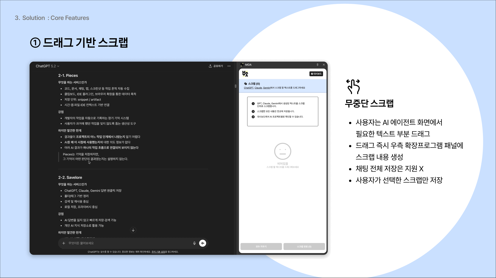
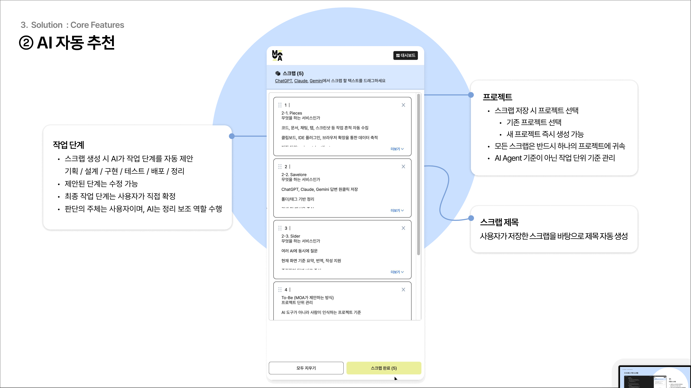
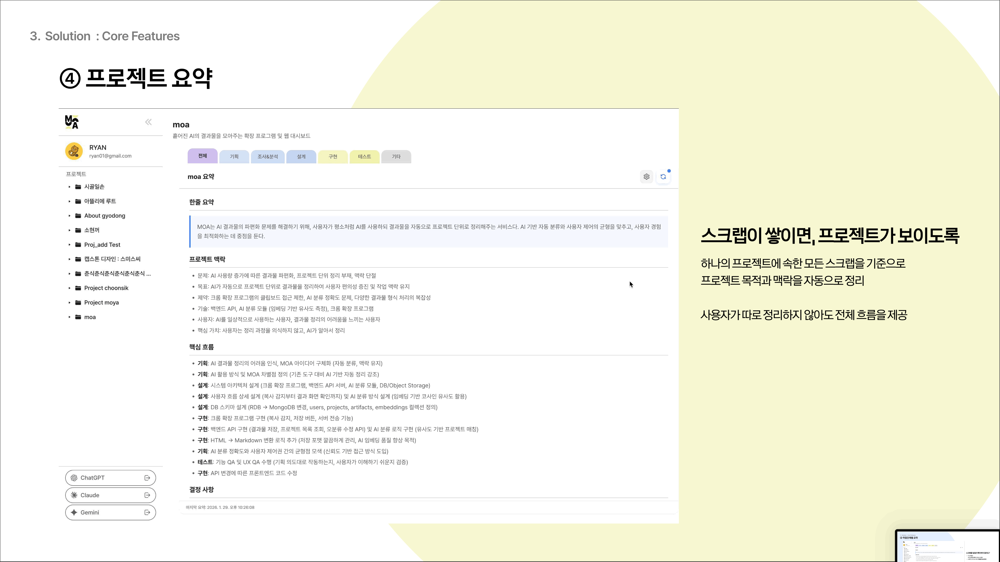
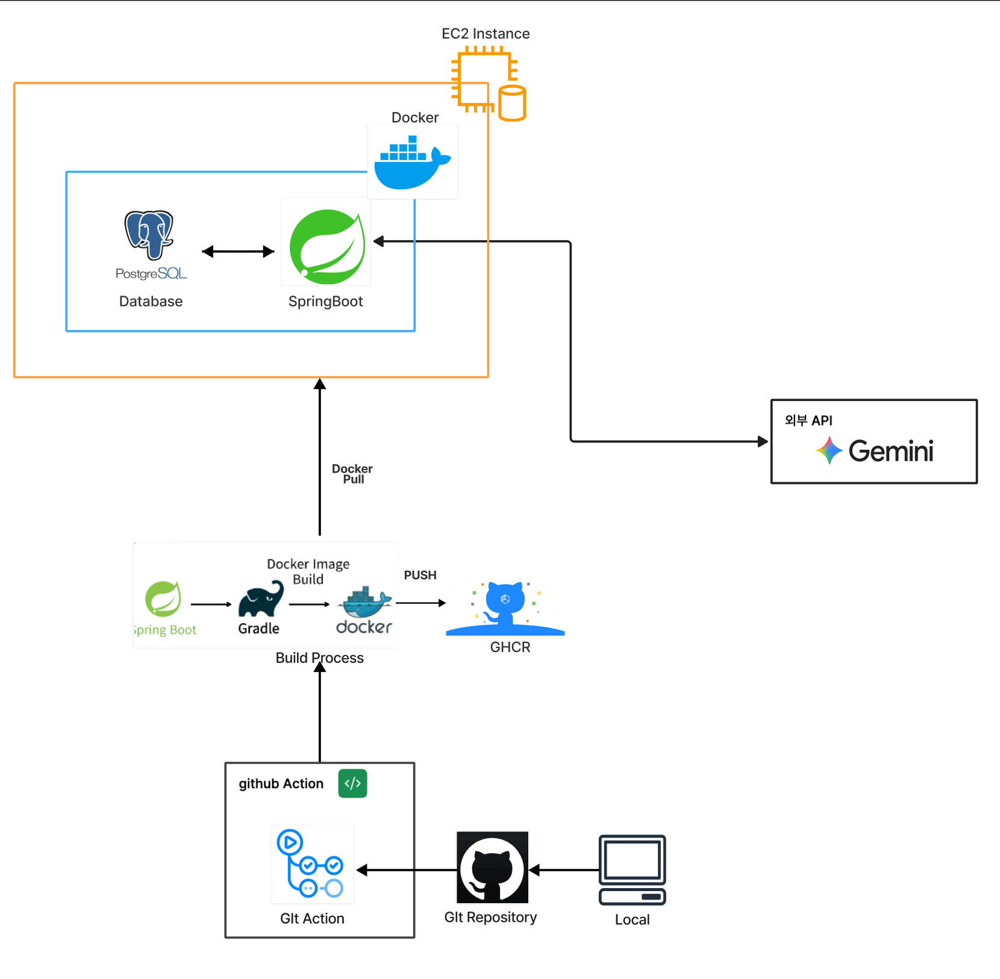
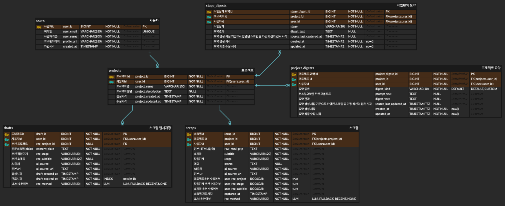

# MOA Backend

**MOA**는 여러 AI 에이전트를 사용하며 흩어지는 작업 결과와 맥락을  
**프로젝트 단위 히스토리**로 자연스럽게 축적·정리해주는 서비스입니다.

MOA 백엔드는  
'스크랩 저장 → AI 보조 추천 → 사용자 확정 → 단계/프로젝트 요약'  
이라는 흐름을 안정적으로 제공하는 역할을 담당합니다.

---

## 목차
- [프로젝트 개요](#-프로젝트-개요)
- [핵심 개념](#-핵심-개념)
- [주요 기능](#-주요-기능)
- [기술 스택](#-기술-스택)
- [시스템 아키텍처](#️-시스템-아키텍처)
- [시작하기](#-시작하기)
- [API 문서](#-api-문서)

---

## 프로젝트 개요

MOA는 다음 문제의식에서 출발했습니다.

- AI를 활용한 작업은 늘어났지만,
- **작업 중 생성되는 맥락, 결정, 시도 과정은 쉽게 사라진다**
- 정리는 여전히 “작업이 끝난 후, 수동으로” 이루어진다

MOA는 이를 다음 방식으로 해결합니다.

1. **스크랩 기반 기록**  
   작업 도중 중요한 맥락을 즉시 저장
2. **AI 보조 추천**  
   프로젝트 / 작업단계 / 소제목을 자동 제안
3. **사용자 확정 중심 설계**  
   AI는 추천만, 결정은 사용자
4. **요약(Digest)을 통한 흐름 가시화**  
   스크랩이 쌓이면 프로젝트의 흐름이 보이도록 요약 제공

---

## 핵심 개념 

### Scrap
- 사용자가 드래그 등으로 저장한 **가장 작은 기록 단위**
- 모든 Scrap은 반드시 하나의 프로젝트에 귀속

### Draft (임시 저장)
- 추천 UI를 위한 **임시 레코드**
- 특징
    - 사용자 액션 직후 생성
    - AI 추천 결과를 담음
    - 확정 시 Scrap에 반영 후 제거
    - TTL 기반 만료 정책 적용

### Stage (작업 단계)
- 기획 / 설계 / 구현 / 테스트 / 배포 / 정리 등
- 고정된 워크플로우가 아닌, **맥락 분류용 개념**

### Digest (요약)
- **Stage Digest**: 특정 작업 단계의 핵심 흐름 요약
- **Project Digest**: 프로젝트 전체 히스토리 요약
- 사용자가 명시적으로 갱신 요청 (자동 갱신 X)

---

## 주요 기능

### 📝 스크랩 

- 스크랩 임시 저장 (Draft 생성)
- AI 기반 프로젝트 / 작업단계 / 소제목 추천
- 사용자 확인 후 확정 저장
- Draft TTL 기반 정리

### 🤖 AI 보조 

- LLM 기반 추천 및 요약 생성
- 스크랩에 없는 내용은 단정하지 않도록 프롬프트/검증기 적용
- 타임아웃 / 실패 시 폴백 전략 제공

### 📚 프로젝트 히스토리

- 단계별 흐름을 요약으로 제공
- “결정 / 변경 중심” 요약 설계

---

## 기술 스택

### Backend
- **Framework**: Spring Boot
- **Language**: Java 21
- **ORM**: Spring Data JPA
- **Database**: PostgreSQL 16
- **Build Tool**: Gradle

### AI
- **LLM**: gemini-2.0-flash
- 
### Infrastructure
- **Reverse Proxy**: Nginx
- **Container**: Docker, Docker Compose
- **Cloud**: AWS EC2
- **CI/CD**: GitHub Actions (build · test · deploy)

### Documentation
- **Ops Docs**: `docs/ops`

---

## 시스템 아키텍처



### 레이어 구조
- **Controller**: REST API 제공
- **Service**: 도메인 중심 비즈니스 로직
- **Repository**: 영속성 관리
- **LLM Adapter**: 외부 AI 의존성 분리

### ERD


---

## 🚀 시작하기

### 필수 요구사항
- Java 21
- Docker & Docker Compose (권장)
- PostgreSQL 16

### 환경 변수
```bash
SPRING_PROFILES_ACTIVE=local
DB_URL=jdbc:postgresql://localhost:5432/moa
DB_USERNAME=moa
DB_PASSWORD=moa
GEMINI_API_KEY=your_key
```

## API 문서
MOA 백엔드는 Draft → Scrap → Digest 흐름을 중심으로 설계되어 있습니다.<br>
AI는 추천과 요약을 보조할 뿐, 모든 저장과 확정은 사용자 액션 기준으로 동작합니다.

애플리케이션 실행 후 확인 가능:
- Swagger UI: /swagger-ui/index.html

> 기본 Prefix: /api <br>
인증: X-User-Id 헤더 기반 (MVP 단계)

**Projects**
> 사용자가 관리하는 프로젝트 리소스

| API | Method | Path | 설명 |
|---|---|---|---|
| 프로젝트 목록 | GET | `/api/projects` | 사용자 프로젝트 리스트 조회 |
| 프로젝트 개수 | GET | `/api/projects/count` | 사용자 프로젝트 총 개수 |
| 프로젝트 생성 | POST | `/api/projects` | 프로젝트 추가 |
| 프로젝트 수정 | PATCH | `/api/projects/{projectId}` | 이름/설명 수정 |
| 프로젝트 삭제 | DELETE | `/api/projects/{projectId}` | 프로젝트 제거 |

**Drafts (임시 저장 / 추천)**
> 추천 UI를 위한 **임시 리소스 

| API | Method | Path | 설명 |
|---|---|---|---|
| 추천/임시저장 생성 | POST | `/api/drafts` | 스크랩 후보 입력 → AI 추천 결과 생성 |
| draft 확정 | POST | `/api/drafts/{draftId}/commit` | 추천값 확정 → scrap 생성 |
| draft 폐기 | DELETE | `/api/drafts/{draftId}` | 임시 저장 삭제 |

- Draft는 TTL 기반 만료 정책 대상
- AI 실패 시에도 Draft는 생성 가능
- commit 시점에만 Scrap이 생성됨

**Scraps**

> 확정된 기록 단위입니다.  <br>
모든 Scrap은 '프로젝트 + 작업단계'에 귀속됨

| API | Method | Path | 설명 |
|---|---|---|---|
| 스크랩 목록 조회 | GET | `/api/scraps` | `projectId` + `stage` 기준 목록 |
| 스크랩 상세 | GET | `/api/scraps/{scrapId}` | 스크랩 단건 조회 |
| 최근 컨텍스트 조회 | GET | `/api/scraps/recent-context` | 최근 스크랩한 프로젝트를 최신순으로 반환 |

**Stage Digests (작업 단계 요약)**

> 특정 프로젝트의 작업 단계별 흐름 요약을 제공

| API | Method | Path | 설명 |
|---|---|---|---|
| 작업단계 요약 조회 | GET | `/api/projects/{projectId}/stages/{stage}/digest` | 요약 상태 조회 (LLM 호출 없음) |
| 작업단계 요약 갱신 | POST | `/api/projects/{projectId}/stages/{stage}/digest:refresh` | 요약 생성/갱신 (LLM 호출) |

- 최신 상태면 요약 생성 생략
- 중복 갱신 요청 시 `409 Conflict`
- 응답에 `outdated` 여부 포함

**Project Digests (프로젝트 전체 요약)**
> 프로젝트 전체 흐름을 스크랩 기반으로 요약

| API | Method | Path | 설명 |
|---|---|---|---|
| 프로젝트 요약 조회 | GET | `/api/projects/{projectId}/digest` | 전체 요약 상태 조회 (LLM 호출 없음) |
| 프로젝트 요약 갱신 | POST | `/api/projects/{projectId}/digest:refresh` | 최신 scrap 기준으로 요약 재생성 |

- 요약은 항상 1건만 유지
- 자동 갱신 ❌
- 사용자 명시적 refresh 요청 기준


